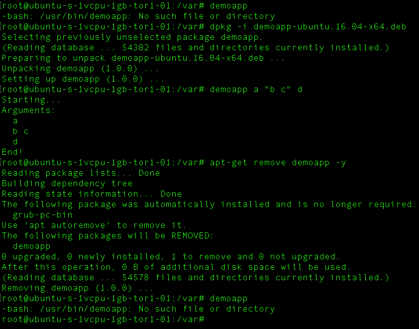

# How to create Ubuntu package from dotnet core console app

This is a demo app showing how to create a native package.
No need to install the dotnet CLI on the target machine.

The ```create-package``` script works on Mac OS X and Linux.

On Mac OS X, you will need to install dpkg. (```brew install dpkg```)

## Steps

- Run: ```./create-package.sh``` to create the .deb file
- Upload .deb file (FTP, etc.) on the machine
- Make sure libunwind8 is installed. (```apt-get install libunwind8```) (see: https://github.com/dotnet/cli/issues/3390)
- ```dpkg -i [.deb file]``` (ex: demoapp-ubuntu.16.04-x64.deb)

## Usage
- demoapp [args]

## Uninstallation
- Run: ```apt-get remove -y demoapp```

## Screenshot

<p align="center">
    
</p>

## FAQ

Problem:
```
Failed to load /usr/bin/demoappbin/libcoreclr.so, error: libunwind.so.8: cannot open shared object file: No such file or directory
Failed to bind to CoreCLR at '/usr/bin/demoappbin/libcoreclr.so'
```

Solution:
```
apt-get install libunwind8
```

# Copyright and license
Code released under the MIT license.
